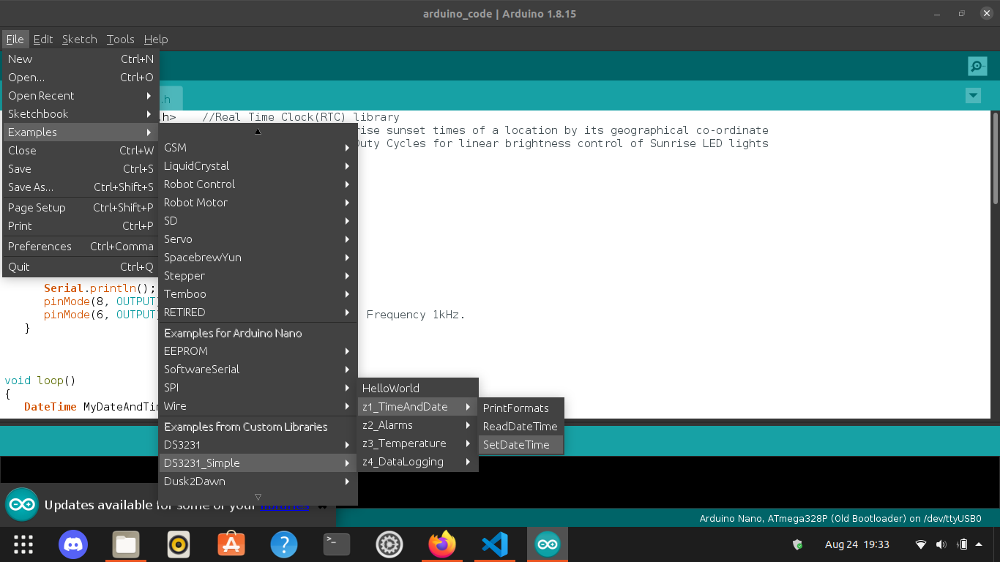

# UPS Switch

## UPS Switch with Sunrise Alarm

### Hardware used:
- Arduino Nano (Atmega328P) Microcontroller
- DS3231 Real Time Clock (RTC) Module
- 230V, 6Amps Relay (12V)
- LED Panel (12V) (For sunrise Alarm)
- General Purpose BJT, MOSFET transistors
- 5mm LED (Optional)

### Requirements:
- [Arduino IDE](https://www.arduino.cc/en/software "Download Arduino IDE")
- [DS3231 RTC Library](https://github.com/sleemanj/DS3231_Simple "DS3231_Simple") by sleemanj
- [Dusk2Dawn Library](https://github.com/dmkishi/Dusk2Dawn "Dusk2Dawn") by dmkishi

### Set-Up time in RTC module:
This step is required to Set-Up the date-time for the first time.
- In Arduino IDE go to File>Examples>DS3231_Simple>z1_TimeAndDate>SetDateTime example.
- Replace date-time, compile and upload your sketch to Arduino board.

### Details:
I have a total of 1kW solar panels installed on rooftop of my house. Power outages in my area are not so bad and the UPS keeps the batteries fully charged at all times. I had installed MPPT solar charge controller to maximize the solar power uses but since the UPS keeps the batteries fully charged, the solar power uses was virtually zero. 

So I made this simple arduino based UPS switch which cuts the Mains power from the UPS before the sunrise so the household electronic equipments use the batteries/solar energy throughout the day to save energy.

The Mains to the UPS is turned back on before the sunset to maximize efficiency of the system. If the Mains is turned on too late, then the batteries will provied energy for the house and UPS will charge the batteries during night which will result in energy wastage. So the Mains to the UPS is turned on before actual sunset depending on the house load.

### Sunrise Alarm:
This project also features a sunrise alarm. The alarm mimics the rising sun by adjusting the brightness of the LED panel installed in the room. The brightness is increased linearly over the course of set duration to wake you up gently.

Although I always covered my eyes with blanket and never woke up with this alarm. :D
